# Guida Operativa: Pipeline CI/CD e Infrastruttura DevOps

## 1. Introduzione

Questa guida espande il documento tecnico sulle **Pipeline CI/CD** e sull’infrastruttura **DevOps** del progetto *Image Presentation AI*, includendo:
- uno **schema visivo esplicativo** dell’intero ciclo DevOps;
- una sezione **pratica passo-passo** per l’attivazione e la manutenzione della pipeline automatizzata.

---

## 2. Visione generale DevOps

L’approccio DevOps integra **sviluppo (Dev)** e **operazioni (Ops)** in un flusso unico e continuo. Il suo scopo è garantire:
- velocità di rilascio;
- coerenza tra ambienti di sviluppo e produzione;
- automazione del testing, build, deploy e monitoraggio.

Nel caso di *Image Presentation AI*, l’infrastruttura DevOps utilizza:
- **GitHub** come repository di versionamento e collaborazione;
- **GitHub Actions** per orchestrare la pipeline CI/CD;
- **Docker** e **Docker Compose** per la containerizzazione;
- **n8n** per automazioni di notifica, backup e monitoraggio post-deploy.

---

## 3. Schema visivo DevOps del progetto

```mermaid
graph TD
A[💻 Sviluppatore] -->|Commit/Push| B[📦 GitHub Repository]
B --> C[🧪 CI: Test automatici]
C --> D[🏗️ Build Docker image]
D --> E[🚀 CD: Deploy automatico su Server/Cloud]
E --> F[📈 Monitoraggio con n8n / Log]
F --> G[🔁 Feedback continuo / Issue Tracking]
G --> A
```



---

## 4. Architettura della pipeline

```
[Commit GitHub]
     ↓
[Test automatici e linting]
     ↓
[Build immagine Docker]
     ↓
[Deploy su server o cloud]
     ↓
[Monitoraggio e notifiche n8n]
```

Ogni fase è automatizzata tramite GitHub Actions e sincronizzata con Docker per garantire coerenza tra i vari ambienti (locale, server interno, cloud).

---

## 5. Configurazione passo-passo della pipeline CI/CD

### 5.1 Prerequisiti

- Repository GitHub del progetto (`image-presentation-ai`)
- Accesso SSH al server di deploy
- Docker e Docker Compose installati sul server
- Chiave SSH privata configurata come secret in GitHub (`SSH_KEY`)

### 5.2 Creazione della pipeline

Crea il file `.github/workflows/deploy.yml` nel repository con il seguente contenuto:

```yaml
name: CI/CD Pipeline

on:
  push:
    branches: [ main ]

jobs:
  build-test-deploy:
    runs-on: ubuntu-latest

    steps:
      - name: Checkout repository
        uses: actions/checkout@v3

      - name: Setup Python
        uses: actions/setup-python@v4
        with:
          python-version: '3.11'

      - name: Install dependencies
        run: pip install -r requirements.txt

      - name: Run tests and lint
        run: |
          pytest || echo "No test found"
          flake8 app/

      - name: Build Docker image
        run: docker build -t image-presentation-ai .

      - name: Deploy to server
        uses: appleboy/ssh-action@master
        with:
          host: ${{ secrets.SERVER_HOST }}
          username: ${{ secrets.SERVER_USER }}
          key: ${{ secrets.SSH_KEY }}
          script: |
            cd /home/deploy/image-presentation-ai
            git pull origin main
            docker compose down
            docker compose up -d --build
```

### 5.3 Aggiunta delle variabili di ambiente (Secrets)

Vai su **GitHub → Settings → Secrets and variables → Actions** e aggiungi:
- `SERVER_HOST` → IP o dominio del server di produzione
- `SERVER_USER` → utente SSH
- `SSH_KEY` → chiave privata per l’accesso remoto

### 5.4 Test della pipeline

1. Fai un commit di prova:
```bash
git add .
git commit -m "Test pipeline CI/CD"
git push origin main
```
2. Vai su **GitHub → Actions → CI/CD Pipeline** e verifica che le fasi vengano eseguite.
3. Se il deploy avviene correttamente, l’app Flask sarà raggiungibile su `http://<SERVER_HOST>:8080`.

---

## 6. Manutenzione e monitoraggio

### 6.1 Log e diagnostica
- I log dei container sono visibili con `docker logs -f <nome_container>`
- I log delle pipeline sono disponibili in **GitHub → Actions → Logs**

### 6.2 Rollback in caso di errore
In caso di fallimento del deploy o bug introdotti:
```bash
git checkout <commit_id_precedente>
docker compose down && docker compose up -d --build
```

### 6.3 Aggiornamenti automatici
Puoi integrare **Watchtower** o **n8n** per:
- riavviare i container periodicamente;
- effettuare backup automatici del volume `data/`;
- inviare notifiche Telegram o email sugli aggiornamenti.

---

## 7. Buone pratiche operative

- Mantenere i branch `main` e `dev` sincronizzati e protetti.
- Eseguire regolarmente test unitari prima del merge.
- Utilizzare tag di versione (`v1.0.0`, `v1.1.0`, …) per identificare rilasci stabili.
- Eseguire backup automatici giornalieri del volume `data/` e dei log.
- Documentare ogni aggiornamento nel changelog (`CHANGELOG.md`).

---

## 8. Diagramma esteso del ciclo DevOps


---

## 9. Conclusione

L’implementazione della pipeline CI/CD e dell’infrastruttura DevOps in *Image Presentation AI* consente di automatizzare ogni fase del ciclo di sviluppo, dal commit iniziale fino al monitoraggio post-deploy. Questo approccio:
- riduce gli errori umani;
- accelera i rilasci;
- assicura consistenza tra ambienti di sviluppo e produzione;
- rende il progetto scalabile e facilmente manutenibile.

